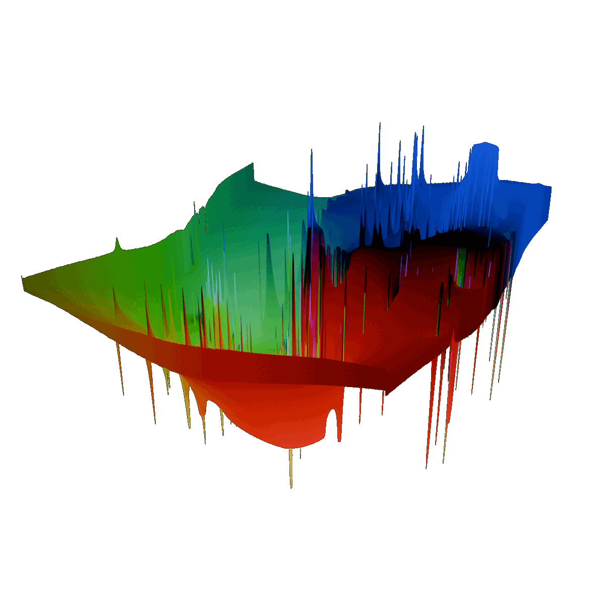

<!--  -->

# Visualizing Gentrification
<!-- *Exploring changes in Bay Area demographics using a flow field* -->
*Visualizing the intensity of gentrification in the Bay Area using flow fields and particle simulations*

This project uses [p5.js](https://p5js.org/), vanilla javascript, and webGL GLSL shaders to parse census data and run a particle simulation based on changes in demographic characteristics. US Census and ACS data from the year 2000 is mapped onto the 2020 census tracts, compared to 2020 data, and then sorted to create a set of weighted attractor and repulsor nodes. These nodes are then passed into the flow field where particles are then pushed and pulled around by them, moving towards attractors and away from repulsors.

## Leapfrogging Between Census Years
The most difficult part of this project turned out to be aligning census data from the 2000 census to 2020 census tracts. Each year the US Census publishes "substantially changed tract" files, but unfortunately these don't contain all the tracts that are actually substantially changed. Instead, the conversion process for the flow field data uses the US Census "Equivalent Tract" files from 2000-2010 and 2010-2020 census years to leapfrog from 2000, to 2010, to 2020 census tracts. 
