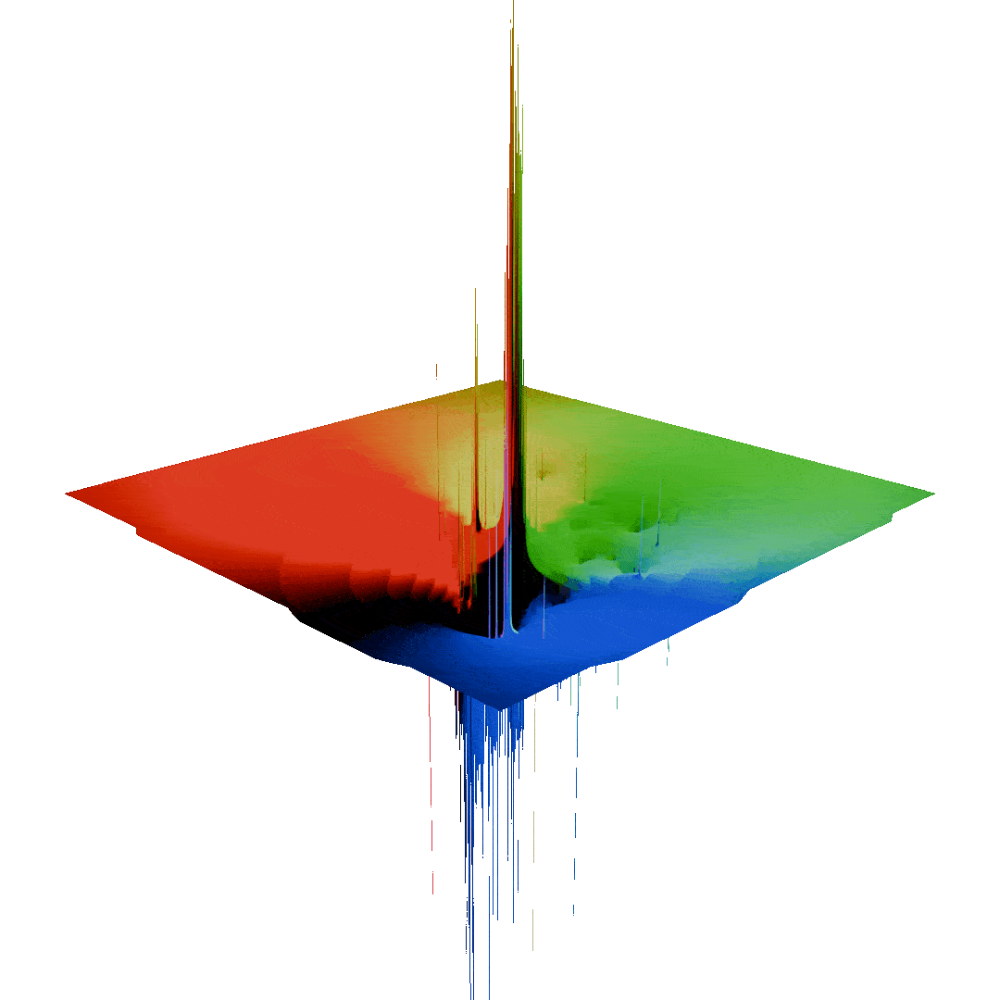

<!-- what should this document be:
 - a brief introduction to what this is
 - a breif summary of how it works
 - a guide to contributing, what code is where -->

 # Gentrification Visualization

### ***An experimental approach to visualization housing inequality and gentrification***

 
*Visualizing the intensity of gentrification in the Bay Area using flow fields and particle simulations. This GIF: change in percentage of white residents in census tracts from 2000 to 2020*

 **Check out the interactive demo *[here](https://alexlafetra.github.io/gentrificationflowfield/)!*** (desktop only for now, floating point textures aren't supported on most mobile browsers)
 
 ## *Visualizing Housing Data Using A Flow Field*

This project is an experimental data-based visualization, aimed at exploring demographic data related to displacement, gentrification, and rising rents in the SF Bay Area. I started this project as an attempt to communicate the intensity of white migration and resulting displacement of nonwhite communities into Oakland neighborhoods, but as I've continued to add to the dataset this project has grown into a tool for visualizing different kinds of demographic change and visualizing different ways the housing crisis continues to impact the Bay. 

Originally, the main goal of this project was to create a map which could help visualize the severity of residential displacement over the last 20 years, especially in the West Oakland and Longfellow neighborhoods in Oakland. It's currently in an unfinished, unpolished state, but I want to find ways that this project can be a tool to draw people into asking more questions about their own relationship to the long-term interconnectedness of inequity, poverty, and gentrification in the Bay, and how city-and-state-level housing policies have failed to address it.

### *behind the scenes...*

...this project is using [p5.js](https://p5js.org/) and vanilla javascript to conjoin census data and US census tract shapefiles downloaded from the US Census website. These datasets are then fed into a series of GLSL shaders which use WebGL to create a flow field and run a particle simulation wherein the particles are pushed and pulled around by the data.

Because the simulation is designed to react to demogrpahic changes over time, feeding data into it requires mapping US Census and ACS data from the year 2000 onto the 2020 census tracts. This is done using the US Census Tract Conversion dataset and some error-checking in javascript.

 After being transformed onto the 2020 census tracts, data from the 2000 and 2020 dataset is compared to create a set of weighted attractor and repulsor nodes based on a demographic comparisons like: `Population`<sub>white people 2020</sub> - `Population`<sub>white people 2000</sub>. These nodes are then passed into the flow field shader which creates a force field representing the effect each tract has according to how it's 2000 and 2020 data compare:



The force field can be thought of as a rubber sheet (or gravitational field, if you're that kind of person) wherein particles roll towards 'low' energy points and roll away from 'high' points. The flowfield and these particle interactions are all calculated and rendered by the GPU using WebGL, allowing it to simulate several hundred thousand particles from the browser.

<!-- As an example, the median rent in US Census Tract 4001 in Alameda County increased from $1,734 in 2000 to $3,500+ (the maximum value recorded in the 2020 census). The comparison function run is `Rent`<sub>2020</sub> - `Rent`<sub>2000</sub>, so we get a value of 1,766. This value is then mapped from -1 to 1 based on the maximum rent increases and drecreases, and then becomes the `strength` of that node/tract pair in the flow field. Once the strengths for each tract are calculated, all the nodes are passed into the 

where particles are accordingly subjected to forces from each census tract based on the statistic being visualized. -->

## *Contributing*

This project is still experimental and any contributions/suggestions are welcome !! The breakdown of the project directory is as follows:

```
gentrificationflowfield/
├─ data/ --> geographic (geoJSON) and demographic (.csv's) data
├─ libraries/ --> p5.min.js & webgl-utils.js
├─ readme/ --> resources for the readme
├─ index.html
├─ readme.md
├─ src/
│  ├─ main.js --> p5 setup code, main loop
│  ├─ shaders.js --> GLSL shader code stored as strings
│  ├─ stats.js --> fns for generating weighted nodes from dataset
│  ├─ presetData.js --> prerendered nodes
│  ├─ flowField.js --> running the flowfield sim
│  ├─ app.js --> running the gui, passing params into sim 
│  ├─ censusTractConversion.js --> for tract conversion
│  ├─ gui.js --> gui classes
│  ├─ mapping.js --> working with geoJSON & drawing census tracts
```

Because loading and processing the full dataset takes about two minutes each time, by default the flowfield will load in precalculated nodes. To add in more data or process it differently, set `devMode = true` in `main.js`; this will force the simulation to load and convert the full dataset, align it to the tract geometry, and recalculate each node and should take 1-2 minutes.

This project uses [p5](https://p5js.org/) to work with WebGL, as well as the [WebGL-utils](https://webgl2fundamentals.org/docs/) library.

